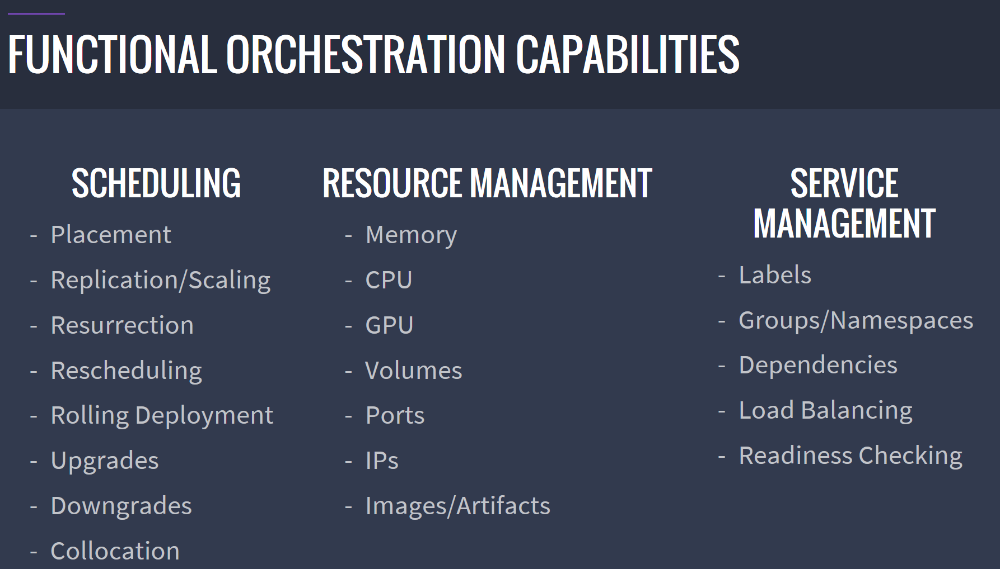
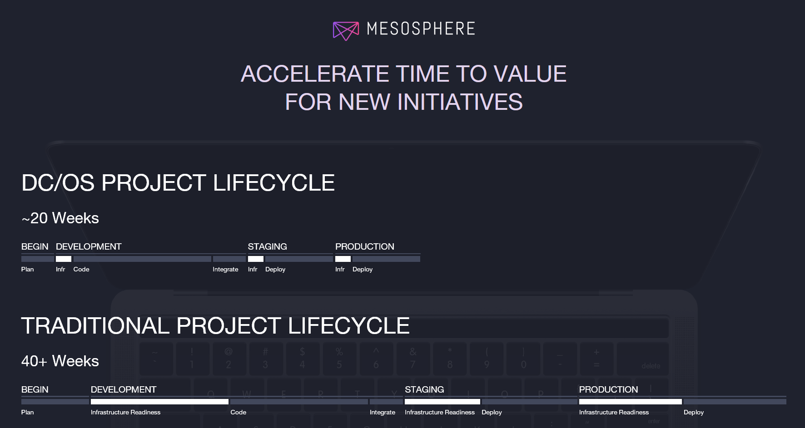

# Why Mesosphere’s DC/OS – Universe Packages

Universal packages on DC/OS dramatically simplify the process of setting up and deploying well known open source software packages, such as Cassandra, Jenkins, Couchbase, MySQL, ElasticSearch – just to name a few. These packages make it possible for cluster operators to get up and running in minutes, instead of hours, even days in some cases.

Without Universe Packages, operators would need to understand the intricate details of each package they would like to install. No two software packages or frameworks is the same when it comes to configuration, so it quickly becomes a daunting task to install a package like Jenkins. Often times, even the documentation/instructions provided by the software authors are missing or incomplete. Adding to the complexity is the fact that the software needs to run within the DC/OS cluster itself, which means the operator must understand not just the software to install, but also the way it needs to interoperate inside the cluster.

Mesosphere engineers have brought years of experience to Universe Packages, insulating operators for the complexities of cluster deployments.

# Universe Packages

The most popular and most powerful packages are available to cluster operators. Such packages as Spark, Cassandra, Jenkins, and many others are availabe for immediate use. With just a simple click gives companies across industries a broad toolset to accelerate time to market and the ability to run modern data-driven applications reliably.

 - Curated Software – The beauty of these packages is that they have been curated by Mesosphere, who has taken the time to leverage best practices for a particular software package, as well as thinking about how it can inter operate in the context of a DC/OS cluster.
 - The Complete List - You can find a complete list here: http://universe.DC/OS.io/#/packages, as well as Appendix A.

The Complete List You can find a complete list here: http://universe.DC/OS.io/#/packages, as well as **Appendix A**.

# Cassandra as an Example

Just take Apache Cassandra is a great example of what the Universe Packages provide.

The link below provides all the terrific details about what a Universe Package can provide.

https://docs.google.com/document/d/1PX0APGMh5vmAQx2QfwTuVJ6uNDWT4G0XVCzRcKkVBZw/edit#

### Amazing Capabilities - all built in

- Installation
- Scaling
- Backup and failure recovery
- Management
- Multi-Data Center replication
- In-place upgrades

Even one of the features you see listed above can take you all day to figure out and configure, such as the ability to replicate across multiple data centers, identifying seed nodes, and more. Other capabilities include a commandline interface that allows you to scale out the Cassandra cluster with additional notes, using a commandline interface and suffering no downtime at all. No other orchestrator offers this level of integration and power.

# Partner SDKs

But that isn’t all. Mesosphere also provides a Partner SDK, allowing ISVs to easily integrate their technologies with DC/OS. It includes a complete SRE (site reliability engineering) best practices implemented in code. Entire data services ecosystems — such as distributed databases, message queues, caches and analytics technologies — can quickly be integrated with DC/OS. These services can then be installed in seconds for fast and reliable implementations. The packages include proven DC/OS capabilities like automatic failure detection and recovery. Again, without these packages cluster operators could spend days performing a correct installation and configuration. There are many dark corners that could be answered only with tribal knowledge of such systems. But with Universal Packages (uncluding the Partner SDK) days of deploying and testing is reduced to just a few mouse clicks.

## Some Recent Additions

The DC/OS Universe service catalog also includes:

- **Alluxio** for high-speed distributed storage access .
- **Couchbase** high-performance and scalable NoSQL database .
- **DataStax Enterprise**, built on the Apache Cassandra distributed database .
- **Elastic Stack** (Elasticsearch, Logstash, Kibana) for analytics and data insights .
- **Redis** in-memory data structure store for high-performance analytics use cases.

# How packages can save operators time, effort and expense

Universe Packages dramatically simplify what otherwise be a complex installation deployment in a cluster. There is some significant knowledge required for deploying into a DC/OS cluster. Universe Packages have an understanding of the functional orchestration capabilities, as seen below: 

### Some additional areas where Universe Packages automatically include:

- **Installation Notes** - To begin, they provide preInstallNotes, which gives the user information they’ll need before starting the installation process. For example, you could explain what the resource requirements are for the service, such as "Unicorns take 7 nodes with 1 core each and 1TB of ram." There are also postInstallNotes.
- **Log Management** - Logs and metrics typically come from several places, making it hard to troubleshoot and isolate problems. DC/OS gives operators a comprehensive view into the health of the application and cluster. The logs and metrics can be easily integrated into existing monitoring tools (e.g., Spunk, ELK, Datadog, Prometheus or custom-developed monitoring tools).
- **Security And Compliance** - Are key concerns for enterprises, especially in the context of new technologies such as Docker containers. DC/OS can lower risk by controlling access to applications and services. In addition, it is possible for operators to determine which users have access to debugging and associated apps while limiting access to the underlying infrastructure. In addition, Mesosphere DC/OS has been independently audited for compliance with NIST, ISO, FISMA, OSC and HIPPA certifications.
- **Built In GPU Support** - Gpu-based scheduling on DC/OS means that GPU-enabled hardware can be pooled with the rest of the infrastructure for highest overall utilization, but also be reserved for machine-learning workloads for maximum performance. With GPU acceleration, neural net training can be 10-20 faster than with CPUs. DC/OS now allows you to isolate and reserve GPU resources for the workloads that need them, but also pool these GPU-enabled resources with the rest of the infrastructure for higher overall utilization.

# Simple Examples Of How These Packages Can Save Operators Significant Time

To drive the point home about time savings, imagine the steps needed to deploy some of the better known packages seen below. You can see that with the help of Universe Packages, significant savings are available:

- **Cassandra** – Like many software packages it is necessary to first install Java 8. Of course, the Universe Package takes care of this. In addition, setting up the path, running Cassandra as a service, checking the status of Cassandra to verify uptime and health. Setting up the seeds (list of IP addresses), indicating the storage port, the listen address and the transport port are all tasks that need to be setup.
- **Jenkins** – Run your continuous integration, automated testing, and continuous delivery jobs for workloads in a DC/OS cluster. If you were to deploy Jenkins by hand, a significant amount of know how is required. For example, you would need to manually pre-configure autoscale build agents, making it possible for DC/OS to create and destroy agents as demand increases and decreases. You would also need to leverage Nginx as a reverse proxy that rewrites the URIs into the absolute paths that Jenkins requires. More complex work involves setting up Canary deployments, which is a pattern for rolling out releases to a subset of DC/OS nodes, allowing you to test your deployment on a small set of nodes before releasing more widely to production. Finally, the Job DSL plugin allows for jobs to be scripted and templated, allowing entire pipelines to be defined within code rather than manually.

# Data Workloads / Stateful Apps / Tasks on VMs

DC/OS offers powerful support for important workloads. First, is significant support for Data workloads, much of it described above. Second, support for stateful applications is made possible through local persistent volumes, protecting applications from data loss during restarts. The resources the application requires are also reserved. Marathon will implicitly reserve an appropriate amount of disk space (as declared in the volume via persistent.size) in addition to the sandbox disk size you specify as part of your application definition.

# Appendix A - The complete list of Universe Packages

<table style="float: none; border-bottom: #b4b4b4 1px solid; text-align: left; border-left : #b4b4b4 1px solid; border-collapse: collapse; 
              font-family: Calibri, 'Segoe UI', Tahoma, Geneva, Verdana, sans-serif; color: #000000; border-top: medium none; 
			  border-right: #b4b4b4 1px solid;"><tr style="background-color:rgb(242,247,247); vertical-align: top"><td style="padding: 5px 10px; border-left: 1px solid #b4b4b4;  border-top: 1px solid #b4b4b4;">
		alluxio-enterprise</td><td style="padding: 5px 10px; border-left: 1px solid #b4b4b4;  border-top: 1px solid #b4b4b4;">
		confluent-replicator</td><td style="padding: 5px 10px; border-left: 1px solid #b4b4b4;  border-top: 1px solid #b4b4b4;">
		koding</td><td style="padding: 5px 10px; border-left: 1px solid #b4b4b4;  border-top: 1px solid #b4b4b4;">
		openldap</td></tr><tr style="background-color: rgb(216,223,230); vertical-align: top"><td style="padding: 5px 10px; border-left: 1px solid #b4b4b4;  border-top: 1px solid #b4b4b4;">
		arangodb</td><td style="padding: 5px 10px; border-left: 1px solid #b4b4b4;  border-top: 1px solid #b4b4b4;">
		confluent-schema-registry</td><td style="padding: 5px 10px; border-left: 1px solid #b4b4b4;  border-top: 1px solid #b4b4b4;">
		kong</td><td style="padding: 5px 10px; border-left: 1px solid #b4b4b4;  border-top: 1px solid #b4b4b4;">
		openldap-admin</td></tr><tr style="background-color:rgb(242,247,247); vertical-align: top"><td style="padding: 5px 10px; border-left: 1px solid #b4b4b4;  border-top: 1px solid #b4b4b4;">
		arangodb3</td><td style="padding: 5px 10px; border-left: 1px solid #b4b4b4;  border-top: 1px solid #b4b4b4;">
		crate</td><td style="padding: 5px 10px; border-left: 1px solid #b4b4b4;  border-top: 1px solid #b4b4b4;">
		linkerd</td><td style="padding: 5px 10px; border-left: 1px solid #b4b4b4;  border-top: 1px solid #b4b4b4;">
		openvpn</td></tr><tr style="background-color: rgb(216,223,230); vertical-align: top"><td style="padding: 5px 10px; border-left: 1px solid #b4b4b4;  border-top: 1px solid #b4b4b4;">
		artifactory</td><td style="padding: 5px 10px; border-left: 1px solid #b4b4b4;  border-top: 1px solid #b4b4b4;">
		datadog</td><td style="padding: 5px 10px; border-left: 1px solid #b4b4b4;  border-top: 1px solid #b4b4b4;">
		linkerd-viz</td><td style="padding: 5px 10px; border-left: 1px solid #b4b4b4;  border-top: 1px solid #b4b4b4;">
		openvpn-admin</td></tr><tr style="background-color:rgb(242,247,247); vertical-align: top"><td style="padding: 5px 10px; border-left: 1px solid #b4b4b4;  border-top: 1px solid #b4b4b4;">
		artifactory-lb</td><td style="padding: 5px 10px; border-left: 1px solid #b4b4b4;  border-top: 1px solid #b4b4b4;">
		DC/OS-enterprise-cli</td><td style="padding: 5px 10px; border-left: 1px solid #b4b4b4;  border-top: 1px solid #b4b4b4;">
		logstash</td><td style="padding: 5px 10px; border-left: 1px solid #b4b4b4;  border-top: 1px solid #b4b4b4;">
		portworx</td></tr><tr style="background-color: rgb(216,223,230); vertical-align: top"><td style="padding: 5px 10px; border-left: 1px solid #b4b4b4;  border-top: 1px solid #b4b4b4;">
		avi</td><td style="padding: 5px 10px; border-left: 1px solid #b4b4b4;  border-top: 1px solid #b4b4b4;">
		dynatrace</td><td style="padding: 5px 10px; border-left: 1px solid #b4b4b4;  border-top: 1px solid #b4b4b4;">
		marathon</td><td style="padding: 5px 10px; border-left: 1px solid #b4b4b4;  border-top: 1px solid #b4b4b4;">
		postgresql</td></tr><tr style="background-color:rgb(242,247,247); vertical-align: top"><td style="padding: 5px 10px; border-left: 1px solid #b4b4b4;  border-top: 1px solid #b4b4b4;">
		beta-cassandra</td><td style="padding: 5px 10px; border-left: 1px solid #b4b4b4;  border-top: 1px solid #b4b4b4;">
		ecr-login</td><td style="padding: 5px 10px; border-left: 1px solid #b4b4b4;  border-top: 1px solid #b4b4b4;">
		marathon-lb</td><td style="padding: 5px 10px; border-left: 1px solid #b4b4b4;  border-top: 1px solid #b4b4b4;">
		postgresql-admin</td></tr><tr style="background-color: rgb(216,223,230); vertical-align: top"><td style="padding: 5px 10px; border-left: 1px solid #b4b4b4;  border-top: 1px solid #b4b4b4;">
		beta-confluent-kafka</td><td style="padding: 5px 10px; border-left: 1px solid #b4b4b4;  border-top: 1px solid #b4b4b4;">
		elastic</td><td style="padding: 5px 10px; border-left: 1px solid #b4b4b4;  border-top: 1px solid #b4b4b4;">
		marathon-slack</td><td style="padding: 5px 10px; border-left: 1px solid #b4b4b4;  border-top: 1px solid #b4b4b4;">
		quobyte</td></tr><tr style="background-color:rgb(242,247,247); vertical-align: top"><td style="padding: 5px 10px; border-left: 1px solid #b4b4b4;  border-top: 1px solid #b4b4b4;">
		beta-dse</td><td style="padding: 5px 10px; border-left: 1px solid #b4b4b4;  border-top: 1px solid #b4b4b4;">
		elasticsearch</td><td style="padding: 5px 10px; border-left: 1px solid #b4b4b4;  border-top: 1px solid #b4b4b4;">
		mariadb</td><td style="padding: 5px 10px; border-left: 1px solid #b4b4b4;  border-top: 1px solid #b4b4b4;">
		redis</td></tr><tr style="background-color: rgb(216,223,230); vertical-align: top"><td style="padding: 5px 10px; border-left: 1px solid #b4b4b4;  border-top: 1px solid #b4b4b4;">
		beta-elastic</td><td style="padding: 5px 10px; border-left: 1px solid #b4b4b4;  border-top: 1px solid #b4b4b4;">
		eremetic</td><td style="padding: 5px 10px; border-left: 1px solid #b4b4b4;  border-top: 1px solid #b4b4b4;">
		memsql</td><td style="padding: 5px 10px; border-left: 1px solid #b4b4b4;  border-top: 1px solid #b4b4b4;">
		registry</td></tr><tr style="background-color:rgb(242,247,247); vertical-align: top"><td style="padding: 5px 10px; border-left: 1px solid #b4b4b4;  border-top: 1px solid #b4b4b4;">
		beta-hdfs</td><td style="padding: 5px 10px; border-left: 1px solid #b4b4b4;  border-top: 1px solid #b4b4b4;">
		etcd</td><td style="padding: 5px 10px; border-left: 1px solid #b4b4b4;  border-top: 1px solid #b4b4b4;">
		minio</td><td style="padding: 5px 10px; border-left: 1px solid #b4b4b4;  border-top: 1px solid #b4b4b4;">
		riak</td></tr><tr style="background-color: rgb(216,223,230); vertical-align: top"><td style="padding: 5px 10px; border-left: 1px solid #b4b4b4;  border-top: 1px solid #b4b4b4;">
		beta-kafka</td><td style="padding: 5px 10px; border-left: 1px solid #b4b4b4;  border-top: 1px solid #b4b4b4;">
		exhibitor</td><td style="padding: 5px 10px; border-left: 1px solid #b4b4b4;  border-top: 1px solid #b4b4b4;">
		mongodb</td><td style="padding: 5px 10px; border-left: 1px solid #b4b4b4;  border-top: 1px solid #b4b4b4;">
		scale</td></tr><tr style="background-color:rgb(242,247,247); vertical-align: top"><td style="padding: 5px 10px; border-left: 1px solid #b4b4b4;  border-top: 1px solid #b4b4b4;">
		beta-kibana</td><td style="padding: 5px 10px; border-left: 1px solid #b4b4b4;  border-top: 1px solid #b4b4b4;">
		flink</td><td style="padding: 5px 10px; border-left: 1px solid #b4b4b4;  border-top: 1px solid #b4b4b4;">
		mongodb-admin</td><td style="padding: 5px 10px; border-left: 1px solid #b4b4b4;  border-top: 1px solid #b4b4b4;">
		spark</td></tr><tr style="background-color: rgb(216,223,230); vertical-align: top"><td style="padding: 5px 10px; border-left: 1px solid #b4b4b4;  border-top: 1px solid #b4b4b4;">
		bitbucket</td><td style="padding: 5px 10px; border-left: 1px solid #b4b4b4;  border-top: 1px solid #b4b4b4;">
		geoserver</td><td style="padding: 5px 10px; border-left: 1px solid #b4b4b4;  border-top: 1px solid #b4b4b4;">
		mongodb-replicaset</td><td style="padding: 5px 10px; border-left: 1px solid #b4b4b4;  border-top: 1px solid #b4b4b4;">
		spark-history</td></tr><tr style="background-color:rgb(242,247,247); vertical-align: top"><td style="padding: 5px 10px; border-left: 1px solid #b4b4b4;  border-top: 1px solid #b4b4b4;">
		bookkeeper</td><td style="padding: 5px 10px; border-left: 1px solid #b4b4b4;  border-top: 1px solid #b4b4b4;">
		gestalt-framework</td><td style="padding: 5px 10px; border-left: 1px solid #b4b4b4;  border-top: 1px solid #b4b4b4;">
		mr-redis</td><td style="padding: 5px 10px; border-left: 1px solid #b4b4b4;  border-top: 1px solid #b4b4b4;">
		spark-notebook</td></tr><tr style="background-color: rgb(216,223,230); vertical-align: top"><td style="padding: 5px 10px; border-left: 1px solid #b4b4b4;  border-top: 1px solid #b4b4b4;">
		cadvisor</td><td style="padding: 5px 10px; border-left: 1px solid #b4b4b4;  border-top: 1px solid #b4b4b4;">
		gitlab</td><td style="padding: 5px 10px; border-left: 1px solid #b4b4b4;  border-top: 1px solid #b4b4b4;">
		msoms</td><td style="padding: 5px 10px; border-left: 1px solid #b4b4b4;  border-top: 1px solid #b4b4b4;">
		spark-shuffle</td></tr><tr style="background-color:rgb(242,247,247); vertical-align: top"><td style="padding: 5px 10px; border-left: 1px solid #b4b4b4;  border-top: 1px solid #b4b4b4;">
		calico</td><td style="padding: 5px 10px; border-left: 1px solid #b4b4b4;  border-top: 1px solid #b4b4b4;">
		grafana</td><td style="padding: 5px 10px; border-left: 1px solid #b4b4b4;  border-top: 1px solid #b4b4b4;">
		mysql</td><td style="padding: 5px 10px; border-left: 1px solid #b4b4b4;  border-top: 1px solid #b4b4b4;">
		spark-thrift-server</td></tr><tr style="background-color: rgb(216,223,230); vertical-align: top"><td style="padding: 5px 10px; border-left: 1px solid #b4b4b4;  border-top: 1px solid #b4b4b4;">
		cassandra</td><td style="padding: 5px 10px; border-left: 1px solid #b4b4b4;  border-top: 1px solid #b4b4b4;">
		hdfs</td><td style="padding: 5px 10px; border-left: 1px solid #b4b4b4;  border-top: 1px solid #b4b4b4;">
		mysql-admin</td><td style="padding: 5px 10px; border-left: 1px solid #b4b4b4;  border-top: 1px solid #b4b4b4;">
		sqlserver</td></tr><tr style="background-color:rgb(242,247,247); vertical-align: top"><td style="padding: 5px 10px; border-left: 1px solid #b4b4b4;  border-top: 1px solid #b4b4b4;">
		ceph</td><td style="padding: 5px 10px; border-left: 1px solid #b4b4b4;  border-top: 1px solid #b4b4b4;">
		hello-world</td><td style="padding: 5px 10px; border-left: 1px solid #b4b4b4;  border-top: 1px solid #b4b4b4;">
		namerd</td><td style="padding: 5px 10px; border-left: 1px solid #b4b4b4;  border-top: 1px solid #b4b4b4;">
		storm</td></tr><tr style="background-color: rgb(216,223,230); vertical-align: top"><td style="padding: 5px 10px; border-left: 1px solid #b4b4b4;  border-top: 1px solid #b4b4b4;">
		ceph-dash</td><td style="padding: 5px 10px; border-left: 1px solid #b4b4b4;  border-top: 1px solid #b4b4b4;">
		httpbin</td><td style="padding: 5px 10px; border-left: 1px solid #b4b4b4;  border-top: 1px solid #b4b4b4;">
		neo4j</td><td style="padding: 5px 10px; border-left: 1px solid #b4b4b4;  border-top: 1px solid #b4b4b4;">
		sysdig-cloud</td></tr><tr style="background-color:rgb(242,247,247); vertical-align: top"><td style="padding: 5px 10px; border-left: 1px solid #b4b4b4;  border-top: 1px solid #b4b4b4;">
		chronos</td><td style="padding: 5px 10px; border-left: 1px solid #b4b4b4;  border-top: 1px solid #b4b4b4;">
		hue</td><td style="padding: 5px 10px; border-left: 1px solid #b4b4b4;  border-top: 1px solid #b4b4b4;">
		neo4j-proxy</td><td style="padding: 5px 10px; border-left: 1px solid #b4b4b4;  border-top: 1px solid #b4b4b4;">
		tunnel-cli</td></tr><tr style="background-color: rgb(216,223,230); vertical-align: top"><td style="padding: 5px 10px; border-left: 1px solid #b4b4b4;  border-top: 1px solid #b4b4b4;">
		clair</td><td style="padding: 5px 10px; border-left: 1px solid #b4b4b4;  border-top: 1px solid #b4b4b4;">
		influxdb</td><td style="padding: 5px 10px; border-left: 1px solid #b4b4b4;  border-top: 1px solid #b4b4b4;">
		neo4j-replica</td><td style="padding: 5px 10px; border-left: 1px solid #b4b4b4;  border-top: 1px solid #b4b4b4;">
		vamp</td></tr><tr style="background-color:rgb(242,247,247); vertical-align: top"><td style="padding: 5px 10px; border-left: 1px solid #b4b4b4;  border-top: 1px solid #b4b4b4;">
		concord</td><td style="padding: 5px 10px; border-left: 1px solid #b4b4b4;  border-top: 1px solid #b4b4b4;">
		instana-agent</td><td style="padding: 5px 10px; border-left: 1px solid #b4b4b4;  border-top: 1px solid #b4b4b4;">
		netsil</td><td style="padding: 5px 10px; border-left: 1px solid #b4b4b4;  border-top: 1px solid #b4b4b4;">
		weavescope</td></tr><tr style="background-color: rgb(216,223,230); vertical-align: top"><td style="padding: 5px 10px; border-left: 1px solid #b4b4b4;  border-top: 1px solid #b4b4b4;">
		confluent-connect</td><td style="padding: 5px 10px; border-left: 1px solid #b4b4b4;  border-top: 1px solid #b4b4b4;">
		jenkins</td><td style="padding: 5px 10px; border-left: 1px solid #b4b4b4;  border-top: 1px solid #b4b4b4;">
		netsil-collectors</td><td style="padding: 5px 10px; border-left: 1px solid #b4b4b4;  border-top: 1px solid #b4b4b4;">
		weavescope-probe</td></tr><tr style="background-color:rgb(242,247,247); vertical-align: top"><td style="padding: 5px 10px; border-left: 1px solid #b4b4b4;  border-top: 1px solid #b4b4b4;">
		confluent-control-center</td><td style="padding: 5px 10px; border-left: 1px solid #b4b4b4;  border-top: 1px solid #b4b4b4;">
		kafka</td><td style="padding: 5px 10px; border-left: 1px solid #b4b4b4;  border-top: 1px solid #b4b4b4;">
		nexus</td><td style="padding: 5px 10px; border-left: 1px solid #b4b4b4;  border-top: 1px solid #b4b4b4;">
		wordpress</td></tr><tr style="background-color: rgb(216,223,230); vertical-align: top"><td style="padding: 5px 10px; border-left: 1px solid #b4b4b4;  border-top: 1px solid #b4b4b4;">
		confluent-kafka</td><td style="padding: 5px 10px; border-left: 1px solid #b4b4b4;  border-top: 1px solid #b4b4b4;">
		kafka-manager</td><td style="padding: 5px 10px; border-left: 1px solid #b4b4b4;  border-top: 1px solid #b4b4b4;">
		nginx</td><td style="padding: 5px 10px; border-left: 1px solid #b4b4b4;  border-top: 1px solid #b4b4b4;">
		zeppelin</td></tr><tr style="background-color:rgb(242,247,247); vertical-align: top"><td style="padding: 5px 10px; border-left: 1px solid #b4b4b4;  border-top: 1px solid #b4b4b4;">
		confluent-replicator</td><td style="padding: 5px 10px; border-left: 1px solid #b4b4b4;  border-top: 1px solid #b4b4b4;">
		kibana</td><td style="padding: 5px 10px; border-left: 1px solid #b4b4b4;  border-top: 1px solid #b4b4b4;">
		nifi</td><td style="padding: 5px 10px; border-left: 1px solid #b4b4b4;  border-top: 1px solid #b4b4b4;">
		</td></tr></table>